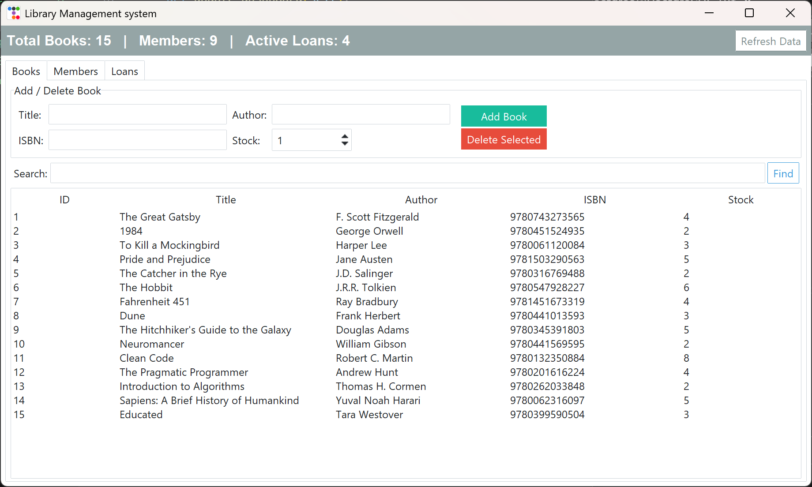

Python-based application for managing library books, members and book loans. It uses GUI created with `ttkbootstrap` that connects to Postgresql database.

GUI allows to:
- easily add, delete and search books in the database
- register library members
- issue and return books with automatic stock adjustment

## Prerequisites

- Python 3.x
- PostgreSQL

## Installation

### 1. Database setup
1. Create a database named `library_db` (by default. Can be changed in the configuration in main.py)
2. Open query tool and run the script in `database/query.sql`. (This will create all tables and populate database with dummy data)

### 2. Application setup
1. Clone repository
2. Install dependencies
3. Configure `main.py` with your PostgreSQL username and password
